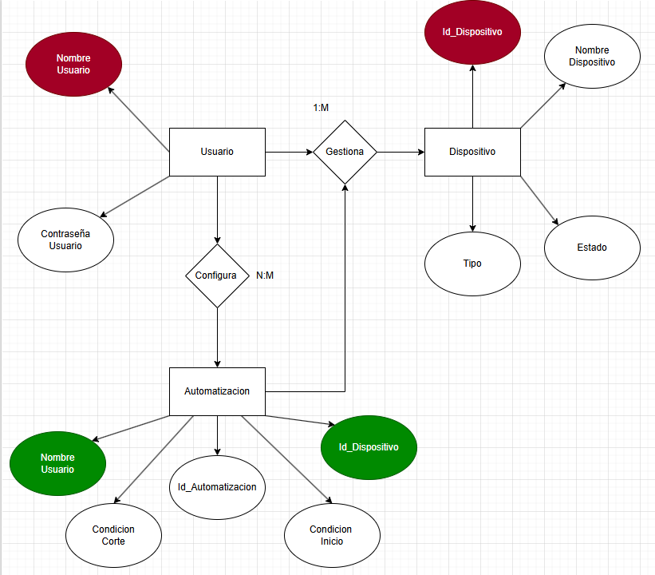

### 🗃️ Base de Datos

El diseño de base de datos para el sistema parte de un enfoque relacional que contempla tres entidades principales: `Usuario`, `Dispositivo` y `Automatización`. Además, se utilizan relaciones intermedias (`Gestiona` y `Configura`) para representar las asociaciones entre entidades de forma más precisa.

#### 📦 Entidades:

- **Usuario:** contiene los datos personales del usuario, como `Nombre Usuario` y `Contraseña Usuario`. Esta entidad se relaciona con `Dispositivo` mediante la relación `Gestiona` (1:M) y con `Automatización` mediante `Configura` (N:M).

- **Dispositivo:** representa los dispositivos del hogar inteligente. Incluye atributos como `Id_Dispositivo`, `Nombre Dispositivo`, `Tipo` y `Estado`. Cada dispositivo puede ser gestionado por un único usuario.

- **Automatización:** permite definir reglas automáticas en el sistema. Posee atributos como `Id_Automatizacion`, `Condición Inicio`, `Condición Corte` y está vinculada tanto al `Usuario` como al `Dispositivo`.

#### 🔗 Relaciones:

- **Gestiona (1:M):** un usuario puede gestionar múltiples dispositivos.
- **Configura (N:M):** un usuario puede configurar varias automatizaciones y una automatización puede estar asociada a más de un usuario.
- **Automatización - Dispositivo:** cada automatización también se vincula a un dispositivo específico mediante su `Id_Dispositivo`.

Este modelo permite representar escenarios como automatizaciones que controlan dispositivos específicos, configuradas por distintos usuarios. El diseño busca asegurar claridad, escalabilidad y preparación para ser implementado en un sistema gestor de base de datos relacional.

